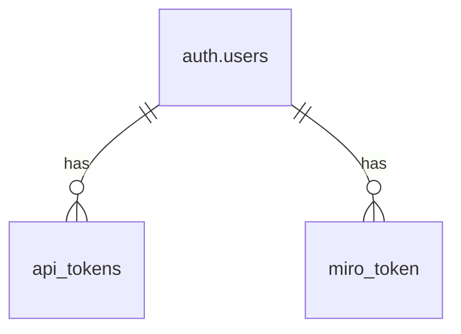

# データベース設計書

## 概要

このドキュメントでは、Miro API 連携サービスで使用するデータベースの設計について説明します。

## データベース概要

- データベース: PostgreSQL
- ホスティング: Supabase

## テーブル設計

### 1. api_tokens

API トークン情報を管理するテーブル

| カラム名   | 型                       | 制約              | 説明            |
| ---------- | ------------------------ | ----------------- | --------------- |
| id         | uuid                     | PK                | API トークン ID |
| user_id    | uuid                     | FK(auth.users.id) | ユーザー ID     |
| token      | text                     | NOT NULL, UNIQUE  | API トークン    |
| name       | text                     | NOT NULL          | トークン名      |
| created_at | timestamp with time zone | DEFAULT now()     | 作成日時        |
| expires_at | timestamp with time zone |                   | 有効期限        |
| is_active  | boolean                  | DEFAULT true      | 有効フラグ      |

### 2. miro_token

Miro のアクセストークン情報を管理するテーブル

| カラム名      | 型                       | 制約              | 説明                 |
| ------------- | ------------------------ | ----------------- | -------------------- |
| id            | uuid                     | PK                | トークン ID          |
| user_id       | uuid                     | FK(auth.users.id) | ユーザー ID          |
| miro_user_id  | text                     | NOT NULL          | Miro ユーザー ID     |
| access_token  | text                     | NOT NULL          | アクセストークン     |
| refresh_token | text                     | NOT NULL          | リフレッシュトークン |
| created_at    | timestamp with time zone | NOT NULL          | 作成日時             |
| expires_in    | bigint                   | NOT NULL          | 有効期限（秒）       |

## リレーションシップ

## インデックス

1. api_tokens

   - token (UNIQUE)
   - user_id
   - expires_at

2. miro_token
   - user_id
   - miro_user_id

## セキュリティ考慮事項

1. トークン管理

   - アクセストークンは暗号化して保存
   - リフレッシュトークンは安全に保管
   - トークンの有効期限を適切に設定

2. アクセス制御

   - ユーザーごとの権限管理
   - API トークンの有効期限管理
   - トークンの有効/無効フラグ管理

3. データ保護
   - 個人情報の適切な管理
   - アクセスログの保持
   - バックアップの定期実行
