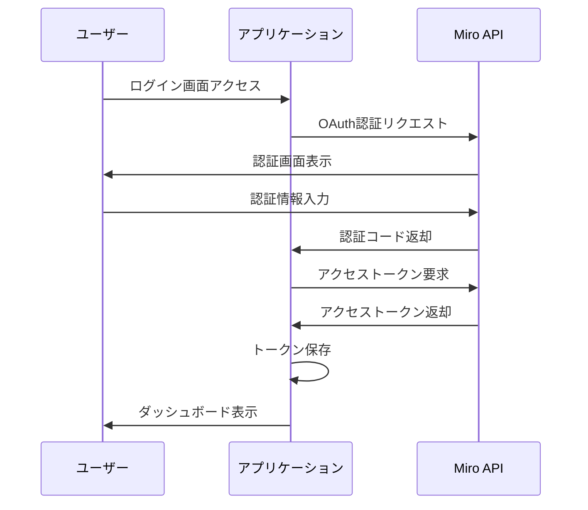
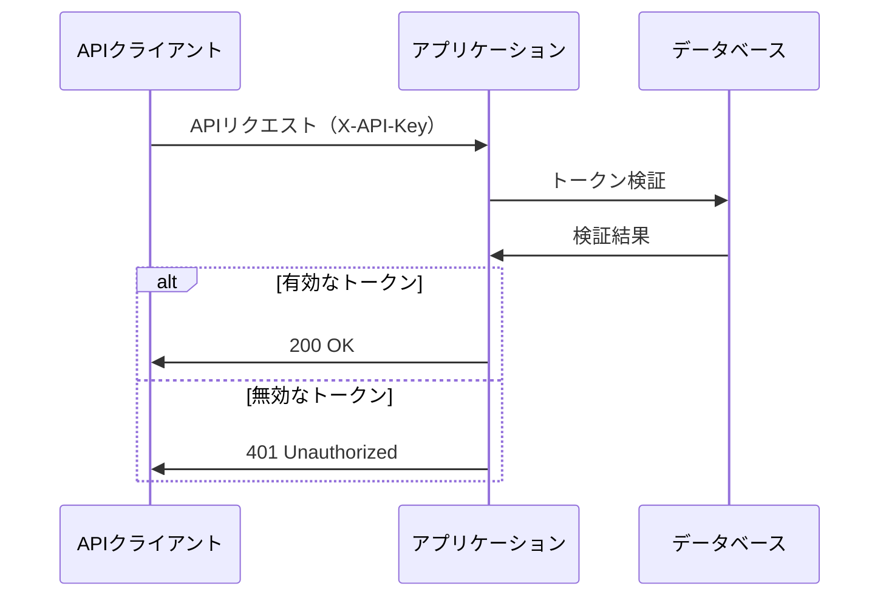
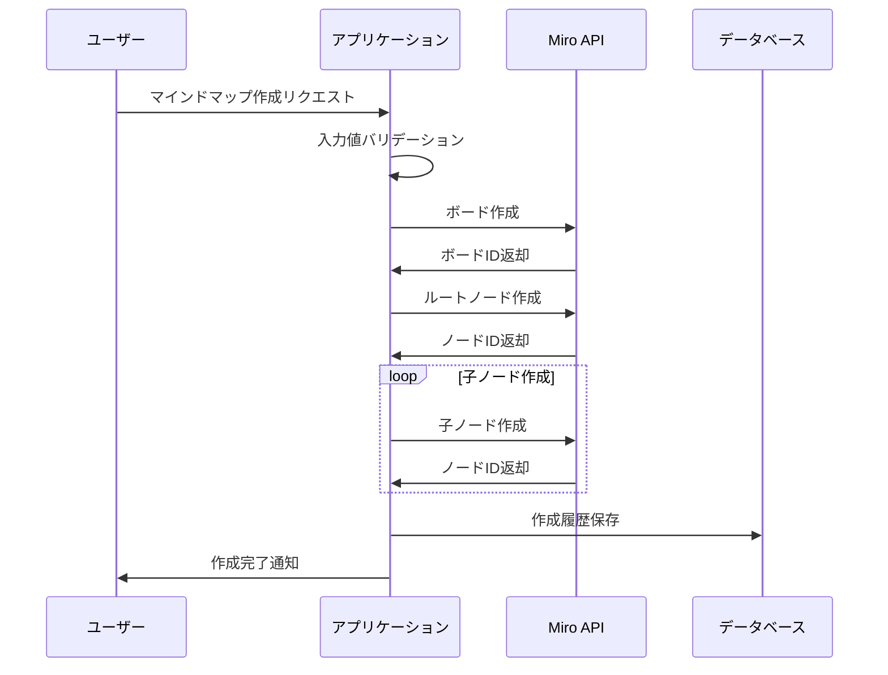
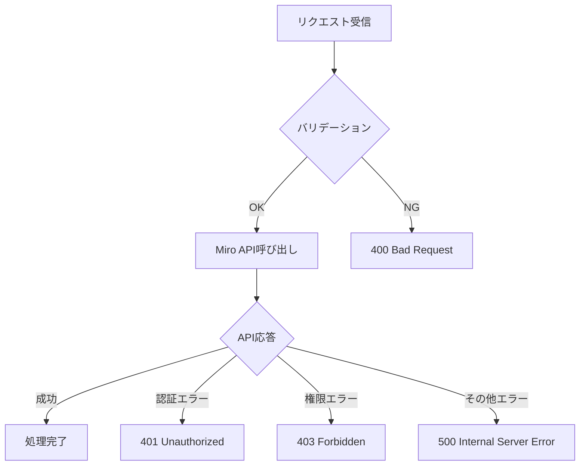

# 処理設計書

## 概要

このドキュメントでは、Miro API 連携サービスの主要な処理フローについて説明します。

## 1. 認証処理

### 1.1 Miro OAuth 認証

### 1.2 API トークン認証

## 2. マインドマップ作成処理

### 2.1 マインドマップ作成フロー

### 2.2 エラーハンドリング

## 3. データ処理

### 3.1 トークン管理

- トークン生成

  - UUID v4 を使用
  - 有効期限設定
  - 使用制限設定

- トークン検証
  - 存在確認
  - 有効期限確認
  - 使用制限確認

### 3.2 ログ管理

- アクセスログ

  - リクエスト時刻
  - エンドポイント
  - ステータスコード
  - レスポンス時間

- エラーログ
  - エラー種別
  - エラーメッセージ
  - スタックトレース
  - コンテキスト情報

## 4. セキュリティ処理

### 4.1 入力値検証

- リクエストボディのバリデーション
- SQL インジェクション対策
- XSS 対策
- CSRF 対策

### 4.2 レート制限

- IP アドレスベース
- トークンベース
- エンドポイント別制限

## 5. パフォーマンス最適化

### 5.1 キャッシュ戦略

- トークンキャッシュ
- API レスポンスキャッシュ
- セッションキャッシュ

### 5.2 非同期処理

- バックグラウンドジョブ
- キューイング
- バッチ処理

## 6. 監視とロギング

### 6.1 メトリクス収集

- レスポンスタイム
- エラーレート
- リソース使用率
- API 使用量

### 6.2 アラート設定

- エラー率閾値
- レスポンスタイム閾値
- リソース使用率閾値
- 異常検知
